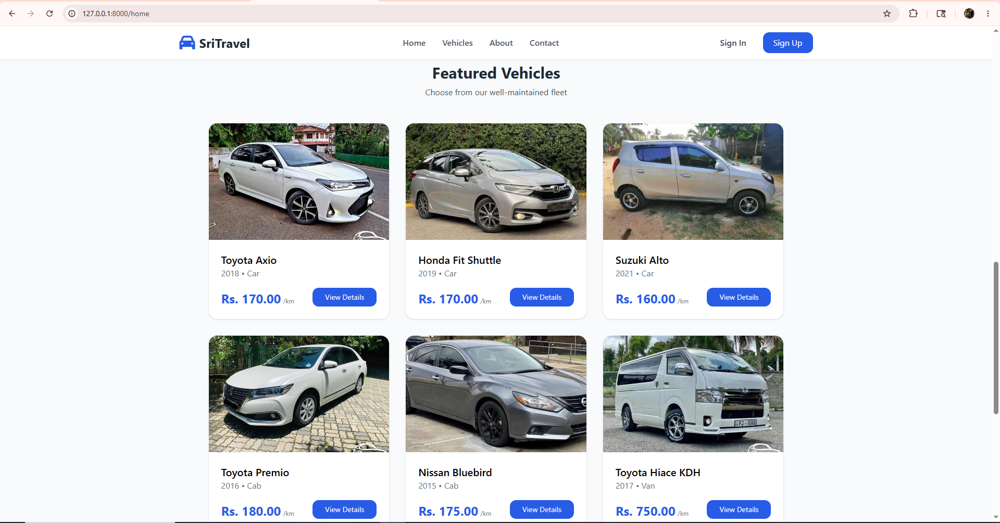
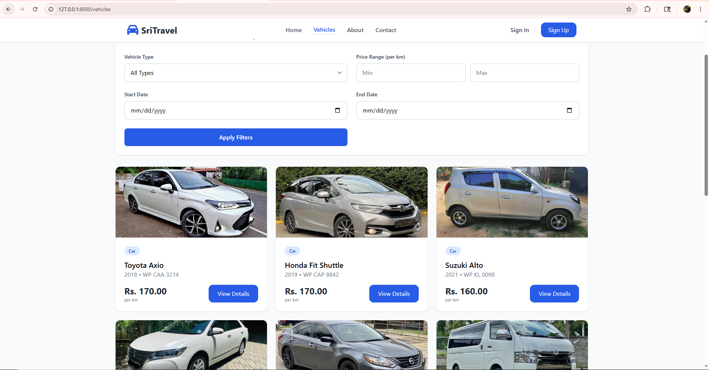
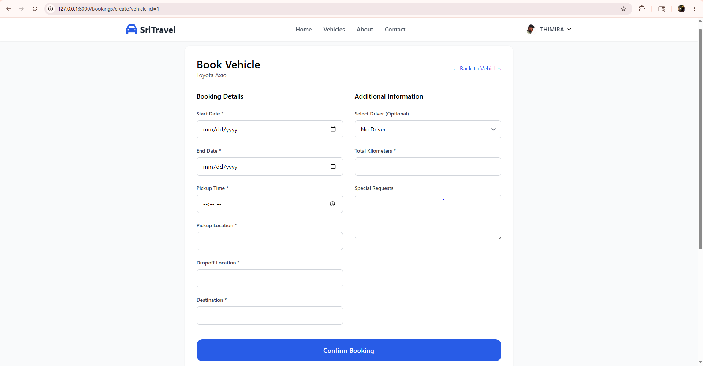
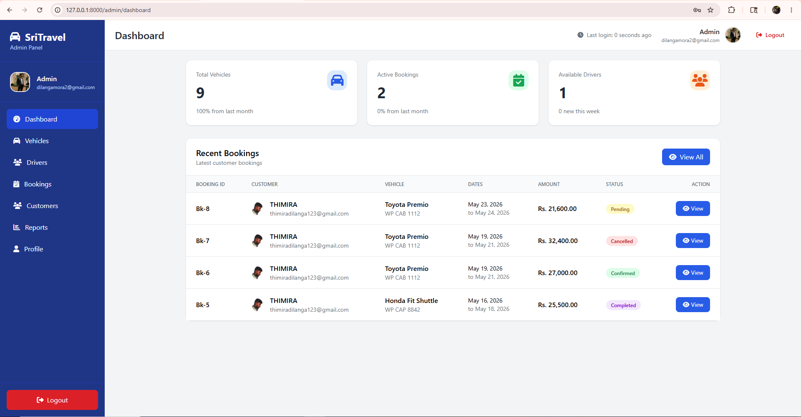
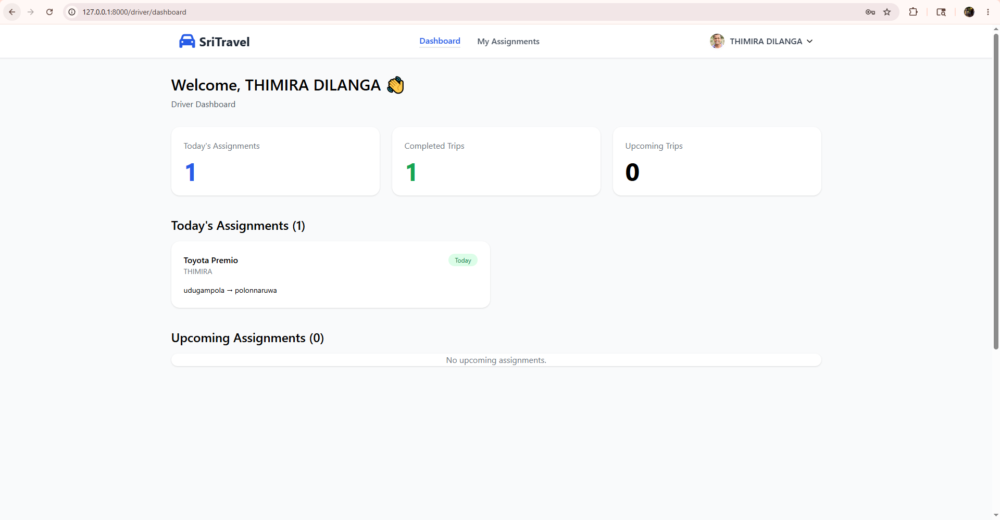

# SriTravel - Vehicle Rental Management System

A modern, full-featured **vehicle rental booking platform** built with **Laravel 12**. It includes three user roles: **Admin**, **Driver**, and **Customer** with complete booking management and real-time availability checking.

## ✨ Features

- **Advanced Vehicle Search** with date-based availability filter
- **Real-time Driver Availability** checking
- **Full Booking System** (Create, Update, Cancel)
- **Role-based Dashboards** for Admin, Driver, and Customer
- **PDF Report Generation** (Bookings & Vehicle Usage Reports)
- **Profile Management** with photo upload
- **Responsive Design** using Tailwind CSS
- **Secure Authentication** & Role-based Middleware

## 🛠 Tech Stack

- **Backend**: Laravel 12, PHP 8.3
- **Frontend**: Blade Templates, Tailwind CSS, Font Awesome
- **Database**: MySQL
- **Authentication**: Laravel Breeze
- **PDF**: Barryvdh DomPDF
- **Image Handling**: Custom Service
- **Date Logic**: Carbon

## 📸 Screenshots

  
  
  
  


## 🚀 Installation & Setup

### Prerequisites
- PHP 8.3+
- Composer
- MySQL
- Node.js & npm

### Steps

```bash
# Clone the repository
git clone https://github.com/dilanga2002/SriTravel.git
cd SriTravel

# Install dependencies
composer install
npm install && npm run build

# Setup environment
cp .env.example .env

# Generate key & setup database
php artisan key:generate
php artisan migrate --seed
php artisan storage:link

# Run the application
php artisan serve

Visit: http://127.0.0.1:8000

Role,  Email,  Password
Admin,  admin@sritravel.com,  password
Driver,  driver@sritravel.com,  password
Customer,  customer@sritravel.com,  password

Made with for portfolio and learning purposes.
